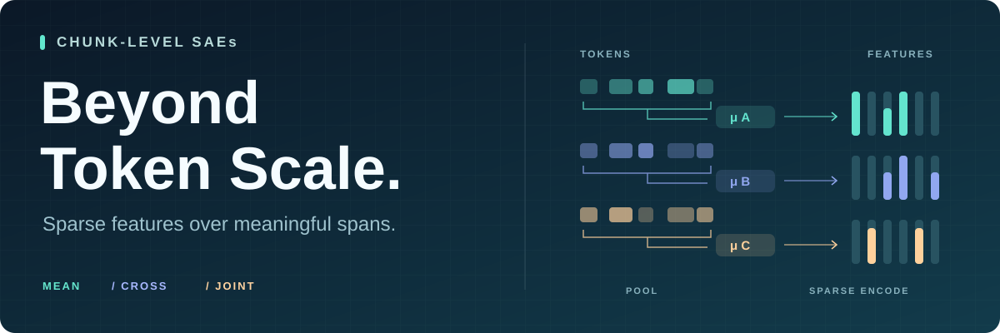
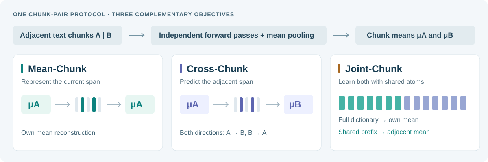

<div align="center">



# Chunk-Level Sparse Autoencoders

### Beyond Token Scale: Chunk-Level Sparse Autoencoders<br>for Reliable Semantic Feature Discovery

**Xu Wang**<sup>1,2</sup> · **Yifan Yang**<sup>2</sup> · **Tinghao Yu**<sup>2</sup> · **Difan Zou**<sup>1</sup><br>
<sup>1</sup>The University of Hong Kong &nbsp; <sup>2</sup>Tencent

[](https://github.com/Xu0615/Chunk_Level_SAE/actions/workflows/ci.yml)
[](https://www.python.org/downloads/)
[](https://pytorch.org/)
[](docs/training_zh.md)

[Quick start](#quick-start) · [Training guide](docs/training.md) · [Methods](docs/methods.md) · [Evaluation](docs/evaluation.md) · [Citation](#citation)

</div>

## Sparse features over meaningful spans

A semantic concept often unfolds across a phrase, sentence, or passage. **Chunk-Level SAEs** learn sparse dictionaries from representations of contiguous text spans, with complementary objectives for reconstructing a chunk and predicting its neighbor. This repository contains the research implementation accompanying *Beyond Token Scale*.

The training pipeline connects **streamed text → independently encoded chunk pairs → versioned activation caches → sparse dictionaries → feature and task evaluation**. Mean-Chunk, Cross-Chunk, and Joint-Chunk share the same data protocol, with token-level BatchTopK and Temporal baselines available for comparison.

- **Three complementary objectives.** Reconstruct the current span, predict an adjacent span, or learn both with a nested shared dictionary.
- **Controlled comparisons.** Content-hash data splits, exact token-occurrence budgets, shared activation caches, and independent chunk forward passes.
- **Training infrastructure.** Distributed BatchTopK, sparse decoding, AuxK, validation-based checkpoint selection, TensorBoard, and resumable checkpoints.
- **A path from first run to research scale.** A CPU example, a reduced single-GPU configuration, and the supplied billion-occurrence Qwen3.5 recipes.

## The methods



| Method | Encoder input | Reconstruction target | Training mode |
| :--- | :--- | :--- | :--- |
| **Mean-Chunk** | Mean representation of chunk A | Mean of A | `mean` |
| **Cross-Chunk** | Mean representation of chunk A | Mean of adjacent chunk B; both directions by default | `cross` |
| **Joint-Chunk** | Mean representation of chunk A | Own mean through the full dictionary; adjacent mean through a shared prefix | `joint_chunk` |
| BatchTopK | Individual token activation | The same token activation | `token` |
| Temporal | Individual token activation | Token reconstruction with a temporally structured objective | `temporal` |

Each chunk is passed through the language model **independently** before pooling. Cross-Chunk therefore learns to predict a neighbor without reading that neighbor during the input forward pass. See [the objective definitions](docs/methods.md) for normalization, sparsity, and the Joint-Chunk decoder layout.

## Quick start

### 1. Install

Use **Python 3.12+**. The full training launchers target **Linux with NVIDIA CUDA GPUs**; the synthetic example and CPU tests can run without a GPU.

```bash
git clone https://github.com/Xu0615/Chunk_Level_SAE.git
cd Chunk_Level_SAE
python3.12 -m venv .venv
source .venv/bin/activate
python -m pip install --upgrade pip
```

Install a PyTorch build appropriate for your CUDA driver using the [official selector](https://pytorch.org/get-started/locally/), then install this project:

```bash
# For a CPU-only environment, this installs the CPU-capable default wheel.
# On a CUDA server, install the appropriate CUDA wheel instead.
python -m pip install 'torch>=2.6'
python -m pip install -e '.[dev]'
```

The project pins `transformers==5.14.1` because the extractor uses Qwen3.5 model internals. Optional CUDA kernels and their opt-in behavior are described in [the installation notes](docs/training.md#environment).

### 2. Try all three objectives on CPU

```bash
python examples/train_synthetic.py --steps 100 --output-dir outputs/synthetic
```

This trains **Mean, Cross, and nested Joint** dictionaries on small synthetic chunk pairs, reports held-out reconstruction error and active-feature counts, and saves three reloadable checkpoints. It exercises the actual SAE classes and checkpoint API; language-model weights and datasets are unnecessary for this example.

### 3. Train on real Qwen3.5 activations

On a Linux CUDA machine, download the [Qwen3.5-2B-Base](https://huggingface.co/Qwen/Qwen3.5-2B-Base) checkpoint and use the reduced configuration:

```bash
hf download Qwen/Qwen3.5-2B-Base --local-dir models/Qwen3.5-2B-Base

# Run from the repository root, in the activated environment.
source configs/quickstart_2b.env
bash run_scripts/train_qwen35_2b_chunk_saes.sh corpus
bash run_scripts/train_qwen35_2b_chunk_saes.sh cache
bash run_scripts/train_qwen35_2b_chunk_saes.sh train
```

The stages verify the dataset stream, extract training/validation caches, then train **Mean-Chunk and Cross-Chunk**. Outputs go to `outputs/quickstart_2b/`.

| Setting | Reduced first run | Supplied 9B research recipe |
| :--- | ---: | ---: |
| GPUs | 1 | 8 |
| Training occurrences | 32,768 | 1,000,000,000 |
| Dictionary width | 4,096 | 65,536 |
| BatchTopK average budget `K` | 32 | 128 |
| Global batch / steps | 256 / 128 | 32,000 / 31,250 |
| Chunk lengths | 32, 64, 128 | 32, 64, 128, 256, 512 |

The reduced recipe is a pipeline check with a small data budget. It does not reproduce the paper's results, and its GPU memory requirements still depend on the backbone and local software stack. [Resource planning and troubleshooting →](docs/training.md#resource-planning)

### 4. Add Joint-Chunk using the same cache

In the same shell after the reduced configuration above:

```bash
SAE_MODES=joint_chunk JOINT_CROSS_PREFIX=2048 JOINT_CHUNK_ALPHA=0.25 \
RUN_NAME=quickstart_joint_chunk \
bash run_scripts/train_qwen35_2b_chunk_saes.sh train
```

`JOINT_CROSS_PREFIX` must be positive and smaller than `SAE_WIDTH`. The supplied paper configuration uses **32,768 of 65,536 features**, with `JOINT_CHUNK_ALPHA=0.25`. A zero prefix selects the older two-decoder implementation; explicitly set the prefix for nested Joint-Chunk.

## Research-scale training

Start in a fresh activated shell when switching from the pilot configuration. The 9B launcher uses zero-based layer **21** and the pinned Pile-Deduplicated stream. Review [storage and GPU requirements](docs/training.md#resource-planning) before extracting a full cache.

```bash
hf download Qwen/Qwen3.5-9B-Base --local-dir models/Qwen3.5-9B-Base
source configs/paper_9b.env

bash run_scripts/train_qwen35_9b_chunk_saes.sh corpus
bash run_scripts/train_qwen35_9b_chunk_saes.sh cache
bash run_scripts/train_qwen35_9b_chunk_saes.sh train

# Reuse the same cache for the nested Joint-Chunk objective.
RUN_NAME=paper_9b_joint_chunk \
bash run_scripts/train_qwen35_9b_joint_chunk_nested.sh
```

The first training command runs the `token`, `temporal`, `mean`, and `cross` modes. The final command runs `joint_chunk`. A model-specific [35B-A3B launcher](run_scripts/train_qwen35_35b_a3b_chunk_saes.sh) is also included.

**Keep these invariants when changing a configuration:**

```text
TRAIN_STEPS × GLOBAL_BATCH_SIZE = TARGET_TRAIN_TOKENS
GLOBAL_BATCH_SIZE % GPU_COUNT = 0
cache world size = training world size
```

Training counts **token occurrences**, including occurrence weighting of chunk means. Changing only the step count or GPU count can invalidate the cache/training contract. The [training guide](docs/training.md) explains paths, configuration overrides, checkpoint selection, and restart behavior.

## Use a trained dictionary

After running the synthetic example:

```python
import torch
from chunk_saes.sae import load_sae

checkpoint = load_sae("outputs/synthetic/mean", device="cpu")
sae = checkpoint.model
hidden = torch.randn(4, checkpoint.config["activation_dim"])

with torch.inference_mode():
    features = sae.encode(hidden)      # Applies the saved activation scale.
    reconstruction = sae.decode(features) / sae.activation_scale

print(features.shape)                 # [4, dictionary width]
```

For a real Mean/Cross/Joint checkpoint, supply **chunk-mean activations from the matching backbone, layer, and independent-chunk protocol**. `decode` returns the normalized target space; divide by the saved scale to return to the original activation units. For Joint-Chunk, `decode` uses the mean readout and `decode_cross` uses the adjacent-chunk readout.

## Evaluation and release scope

Evaluation modules cover reconstruction fidelity, dictionary health, feature consistency, document linking, supervised transfer, reasoning, and visualization. They expose explicit inputs so experiments can be inspected and rerun. [Evaluation map and prerequisites →](docs/evaluation.md)

This release includes the **source, training recipes, evaluation utilities, and tests**. Pretrained SAE weights, full activation caches, prepared benchmark artifacts, and external judge services are separate inputs. Some paper analyses need those additional artifacts; the `steering` namespace currently contains no complete standalone steering runner.

CPU CI checks imports, shell syntax, the test suite, the synthetic checkpoint round-trip, and Python packaging. Full CUDA extraction, multi-GPU throughput, and reproduction of paper results require the corresponding hardware and data.

## Repository map

```text
Chunk_Level_SAE/
├── configs/                 # Reduced 2B and research-scale 9B settings
├── examples/                # Download-free CPU training example
├── run_scripts/             # Model-specific training / evaluation launchers
├── src/
│   ├── chunk_saes/          # SAE models, streaming, caches, checkpoints
│   ├── train_chunk_saes.py  # Distributed training entry point
│   ├── extract_streaming_chunk_activations.py
│   ├── evals/               # Evaluation modules grouped by task
│   └── motivation/          # Controlled semantic-feature experiments
├── tests/                   # Protocol, model, cache, and evaluation tests
└── docs/                    # Methods, training, evaluation, Chinese guide
```

Legacy top-level evaluation scripts in `src/` remain as compatibility entry points; new integrations should use the modules under `src/evals/`.

## Documentation

| Guide | What it covers |
| :--- | :--- |
| [Training](docs/training.md) | Environment, data, launchers, configuration, checkpoints, troubleshooting |
| [中文训练指南](docs/training_zh.md) | 从安装、首次试跑到论文规模训练的完整流程 |
| [Methods](docs/methods.md) | Mean/Cross/Joint objectives, shared-prefix semantics, occurrence accounting |
| [Evaluation](docs/evaluation.md) | Available tasks, required inputs, RFVE reference construction |
| [Contributing](CONTRIBUTING.md) | Development checks and experiment reporting |

## Citation

If you use this implementation, please cite the repository. The bibliographic metadata is also available in [CITATION.cff](CITATION.cff); a paper-specific citation can be added when its public identifier is available.

```bibtex
@misc{wang2026chunklevelsaes,
  author       = {Xu Wang and Yifan Yang and Tinghao Yu and Difan Zou},
  title        = {Chunk-Level Sparse Autoencoders: Beyond Token Scale},
  year         = {2026},
  howpublished = {GitHub repository},
  url          = {https://github.com/Xu0615/Chunk_Level_SAE}
}
```

For research questions, contact [Xu Wang](mailto:sunny615@connect.hku.hk) or [Difan Zou](mailto:dzou@hku.hk). For reproducible code issues, please [open an issue](https://github.com/Xu0615/Chunk_Level_SAE/issues).
